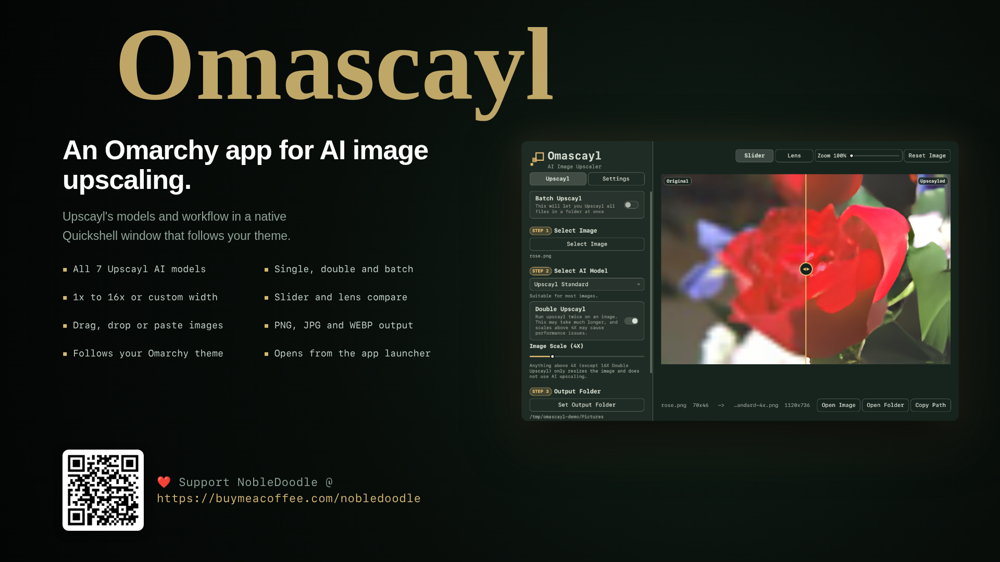
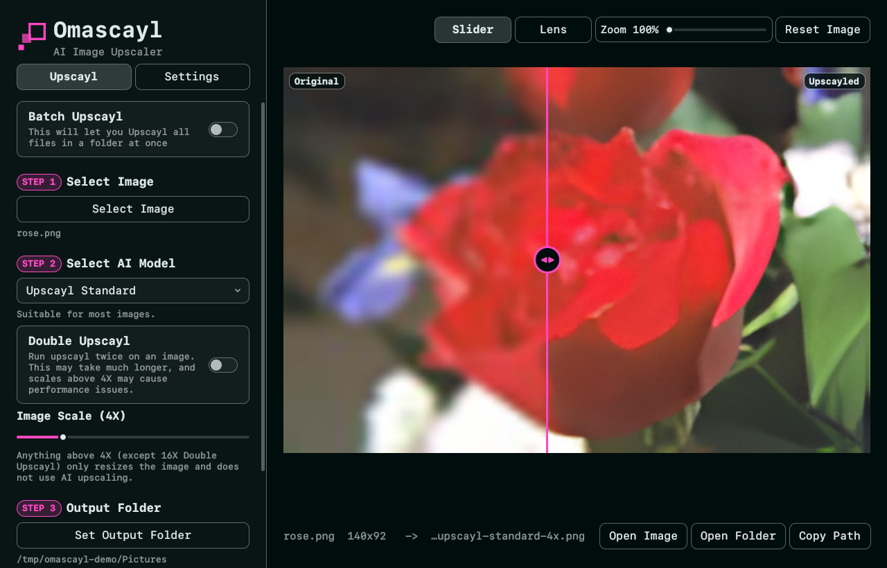
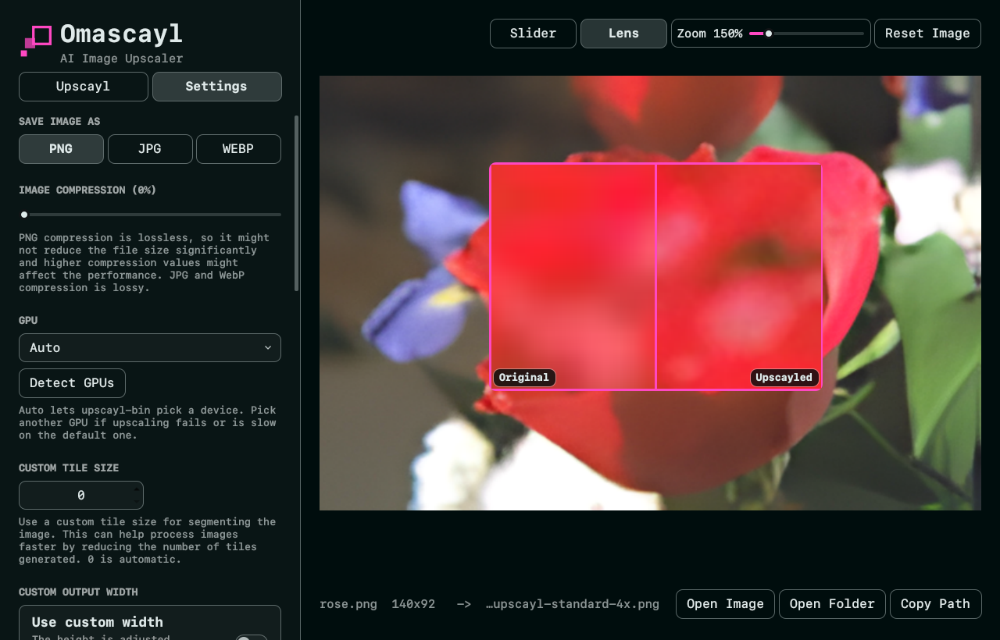

# Omascayl

**Upscayl's AI image upscaler as a native Quickshell app for Omarchy.**



Omascayl is a QML/Quickshell port of [Upscayl](https://github.com/upscayl/upscayl).
It runs the same `upscayl-bin` backend ([upscayl-ncnn](https://github.com/upscayl/upscayl-ncnn)) with the same models, arguments and output names. The Electron UI is replaced by a small Quickshell window. That window uses Omarchy's own shell components and follows your Omarchy theme live.

## Install

```fish
omarchy plugin add https://github.com/NobleDoodle/omascayl --enable
```

Then open **Omascayl** from the app launcher.

> [!TIP]
> **You don't install any dependencies yourself.** On first open, Omascayl checks what it needs and lists anything missing. Choose **Open setup in a terminal**, and the setup opens in Omarchy's floating terminal:
>
> 1. It shows exactly what it will install.
> 2. It asks once: **Proceed? [Y/n]**. Press Enter to go ahead.
> 3. It downloads the Upscayl engine and models (about 175 MB, no password). It installs any missing packages with `pacman`, which is the only step that asks for your password.
>
> The open window notices when setup finishes, with no restart. **Settings → Dependencies** shows the status and runs setup again any time.

The plugin is an app, not a bar widget. As the shell loads it, it adds:
- an **Omascayl** entry to the app launcher, also offered under *Open With* for PNG, JPEG and WebP
- its icon
- the `omascayl` command in `~/.local/bin`

Update with `omarchy plugin update io.github.nobledoodle.omascayl`, then `omarchy-restart-shell`. Uninstall with `omarchy plugin remove io.github.nobledoodle.omascayl`. The launcher entry, icon, command and downloaded engine go with it, and your settings in `~/.local/state/omascayl` are kept.

### Other ways to install

From a clone, either as the same plugin or **standalone**, as its own Quickshell process that doesn't touch `omarchy-shell`:

```fish
git clone https://github.com/NobleDoodle/omascayl
cd omascayl
./install.sh --plugin    # the same plugin install, from this checkout
./install.sh             # or: standalone, its own Quickshell process
```

- **`--plugin`** runs `omarchy plugin add` on the checkout. `omarchy plugin update` then follows the branch checked out in that repository.
- **Without a flag**, the app is copied to `~/.local/share/omascayl/app` with its own launcher entry and command.

`./install.sh --uninstall` removes either form. The two forms share their settings. To run from a checkout without installing: `bin/omascayl` (add `--standalone` to skip an installed plugin).

How the plugin's app integration works: `omarchy plugin add` runs no install scripts, so on every load `bin/omascayl-integrate` makes sure the launcher entry, icon and command exist (it changes nothing once they do). They point at a small launcher in `~/.local/share/omascayl`, outside the plugin folder. If the plugin is removed, that launcher deletes them, either as the shell unloads the plugin or, at the latest, the next time they are used.

## Requirements

The setup above takes care of all of these. This is what it checks for.

**Required:**
- **The Upscayl engine and its models.** The setup downloads them into `~/.local/share/omascayl/backend`. That's upscayl-ncnn's own engine release plus Upscayl's seven models, each checked against a SHA-256 pinned in the script. They're removed with Omascayl. An existing Upscayl install (the AUR `upscayl-bin` package) is used instead if present, and `OMASCAYL_BIN` and `OMASCAYL_MODELS` point Omascayl at any other copy.
- **A Vulkan GPU driver:** `vulkan-icd-loader` plus your GPU's driver. The setup installs `vulkan-radeon` or `vulkan-intel` for the GPU it finds. An NVIDIA driver is left to you, since it must match your kernel driver.

**Recommended** (Omarchy ships them):
- `python-gobject` with an xdg-desktop-portal FileChooser backend (`xdg-desktop-portal-gtk`) for the file pickers, or `zenity`
- `wl-clipboard` for paste
- `libnotify` for notifications
- `xdg-utils` for *Open Image* / *Open Folder*

**Already part of Omarchy:** the Quickshell-based `omarchy-shell` and `quickshell` 0.3+. Omascayl imports Omarchy's `shell/Commons` and `shell/Ui` modules.



## Features

Everything in Upscayl 2.15's workflow:

- **Single image, Double Upscayl and Batch Upscayl** (a whole folder into an `upscayl_<format>_<model>_<scale>` subfolder).
- **All seven built-in models.** Upscayl Standard and Lite, High Fidelity, Remacri, Ultramix, Ultrasharp and Digital Art, each with Upscayl's description. **Custom NCNN models** come from a folder of your own.
- **Image scale from 1x to 16x**, or a **custom output width**. Above the model's native 4x, the extra size is a resize, as in Upscayl.
- **PNG / JPG / WEBP output** with compression, **GPU selection** (detected devices are listed by name), **tile size** and **TTA mode**.
- **Before/after comparison**:
  - A draggable slider with hover zoom of 100–400%.
  - A **lens** that shows the original and the result side by side under the pointer.
- **Image input** from the desktop's file picker (the xdg-desktop-portal dialog, shown by a separate process), by **dragging an image or folder** onto the window, or with **Ctrl+V**. Ctrl+V takes either a file copied in a file manager or raw image data such as a screenshot.
- **Same behaviors as Upscayl**:
  - It reuses an existing result unless *Overwrite Previous Upscale* is on.
  - *Save Output Folder*, desktop notifications, copyable logs, usage stats, and reset.
  - Upscayl's error messages for GPU, read/write and tile-size failures.
- **Background jobs:** as a plugin, an upscayl keeps running after you close the window.



Left out on purpose: Upscayl's theme and language pickers (the window follows Omarchy instead), auto-update, telemetry and the Upscayl Cloud prompts.

## Usage

```fish
omascayl                 # open the window
omascayl photo.jpg       # open with an image
omascayl ~/Pictures/set  # open a folder in batch mode
```

Running `omascayl` again while it is open hands the image or folder to the open window and focuses it.

| Key | Action |
|-----|--------|
| Ctrl+O | Select an image (or a folder in batch mode) |
| Ctrl+V | Paste an image or a copied image file |
| Ctrl+Enter | Upscayl |
| Esc | Close an error, or stop a running upscayl |
| Ctrl+Q | Quit (as a plugin: close the window; a running upscayl finishes in the background) |

Results are saved next to the source image by default. Upscayl's naming is kept: `<name>_upscayl_<4x|1920px>_<model>.<format>`. Pasted images are saved under `~/.cache/omascayl/clipboard`, and their results go to your Pictures folder.

Scripts can drive it over IPC. As a plugin, the methods are `show`, `open <path>`, `pick <image|batch|output|models>`, `close`, `upscayl`, `stop` and `status`:

```fish
omarchy-shell omascayl open ~/Pictures/cat.png
omarchy-shell omascayl upscayl
omarchy-shell omascayl status
```

The standalone app takes the same calls on its own instance: `qs ipc -p $XDG_RUNTIME_DIR/omascayl/config call omascayl status`.

## How it fits together

`bin/omascayl` first asks `omarchy-shell` whether the plugin is loaded. If it is, it opens the plugin's window; if not, it runs standalone. For standalone, it finds Omarchy's shell modules and the upscayl backend (`bin/omascayl-backend`). It then assembles a runtime config in `$XDG_RUNTIME_DIR/omascayl/config` (symlinks to `src/` plus Omarchy's `Commons` and `Ui`) and starts `qs -n -p` on it. Without a private `XDG_RUNTIME_DIR`, the config goes to `~/.cache/omascayl/runtime` instead, never `/tmp`.

As a plugin, `manifest.json` declares a `keepLoaded` `panel` whose entry point is `Plugin.qml`. It hosts the same `src/` app inside `omarchy-shell` and implements the host's `open` / `close` lifecycle.

| File | Role |
|------|------|
| `src/Core.js` | Model catalog, `upscayl-bin` arguments, output naming, stderr parsing. A direct port of Upscayl's `get-arguments` and `*-upscayl` handlers. |
| `src/Upscaler.qml` | Runs jobs: progress, Double Upscayl's second pass, batch counting, stop, errors. |
| `src/App.qml` | Selection, paste and drop, model lists, validation. |
| `src/Settings.qml` | Preferences and stats in `~/.local/state/omascayl/settings.json`. |
| `src/AppWindow.qml`, `Sidebar.qml`, `UpscaylTab.qml`, `SettingsTab.qml`, `Viewer.qml`, `CompareView.qml` | The UI. |

File and folder pickers come from the xdg-desktop-portal, shown by a separate process (`bin/omascayl-pick`), so GTK's file chooser never runs inside `omarchy-shell`; a crash in it could otherwise take the whole desktop shell down.

All commands run without a shell (argv lists), so file names are never interpreted. The one exception is paste: `sh -c` redirects `wl-paste` into a file, with both values passed as positional arguments.

## Security

Omascayl runs inside `omarchy-shell`, and part of it runs on every shell start without anyone watching. So it follows the rules the Omarchy plugin marketplace review asks of plugins that do this:

- **No command comes from the inherited `PATH`.** The app runs every tool by absolute path (`/usr/bin/...`) with `PATH` pinned to `/usr/bin:/usr/share/omarchy/bin`. Every script sets the same `PATH` first and has an absolute shebang. The Python helpers run isolated (`python3 -I`), so `PYTHONPATH` and user site-packages don't apply either.
- **Unattended writes can't be redirected.** `bin/omascayl-integrate` (run at every shell start) and the launcher it leaves behind write and delete only through directory handles. Those handles are opened without following symlinks and checked to be yours. New files go through a random `O_EXCL|O_NOFOLLOW` temporary that is fsynced and renamed into place (`bin/omascayl_fs.py`). Nothing uses a predictable temporary or lock name, or `/tmp`. Reads are size-limited and never block on a FIFO, and that includes the settings file.
- **The setup asks first, and its package list is fixed.** `bin/omascayl-setup` runs in a terminal and installs only after you answer "Proceed? [Y/n]". The only names it ever passes to `sudo pacman` come from a fixed list in the script, after `--`. The engine and models are pinned by SHA-256. `bin/omascayl-store` checks them again on the bytes it copies into place, so a file changed after the check can't get in.
- **Text shown is plain text.** File names, error output and clipboard contents are never rendered as rich text.

Each of these has a test that plants the symlink, FIFO or package name in question (`tests/integrate.sh`, `tests/setup.sh`, `tests/picker.sh`).

## Tests

```fish
node --test tests/     # Core.js unit tests
tests/e2e.sh           # real upscales through the app, offscreen (needs a GPU, ImageMagick, jq)
tests/snapshot.sh out.png '{"tab":"settings"}'   # render one screen offscreen
tests/picker.sh        # bin/omascayl-pick against a mock portal on a sealed private bus
tests/integrate.sh     # the plugin's launcher entry, icon and command, in a scratch HOME
tests/setup.sh         # bin/omascayl-setup with a fake sudo and a local mirror; nothing real is installed
```

## License

Copyright © 2026 NobleDoodle

This program is free software: you can redistribute it and/or modify it under the terms of the GNU Affero General Public License, **version 3 only** (SPDX: `AGPL-3.0-only`), as published by the Free Software Foundation. The full text is in [`LICENSE`](LICENSE).

This program is distributed in the hope that it will be useful, but WITHOUT ANY WARRANTY; without even the implied warranty of MERCHANTABILITY or FITNESS FOR A PARTICULAR PURPOSE. See the GNU Affero General Public License for more details.

Omascayl reimplements [Upscayl](https://github.com/upscayl/upscayl)'s behavior and reuses its UI wording and model descriptions. Upscayl is © Nayam Amarshe, TGS963 and contributors, and is licensed under the AGPL version 3, which it doesn't extend to later versions. Omascayl therefore doesn't either.

Model licenses are their authors'. Remacri, Ultramix and Ultrasharp are for **non-commercial use only**, as Upscayl's model picker notes.
